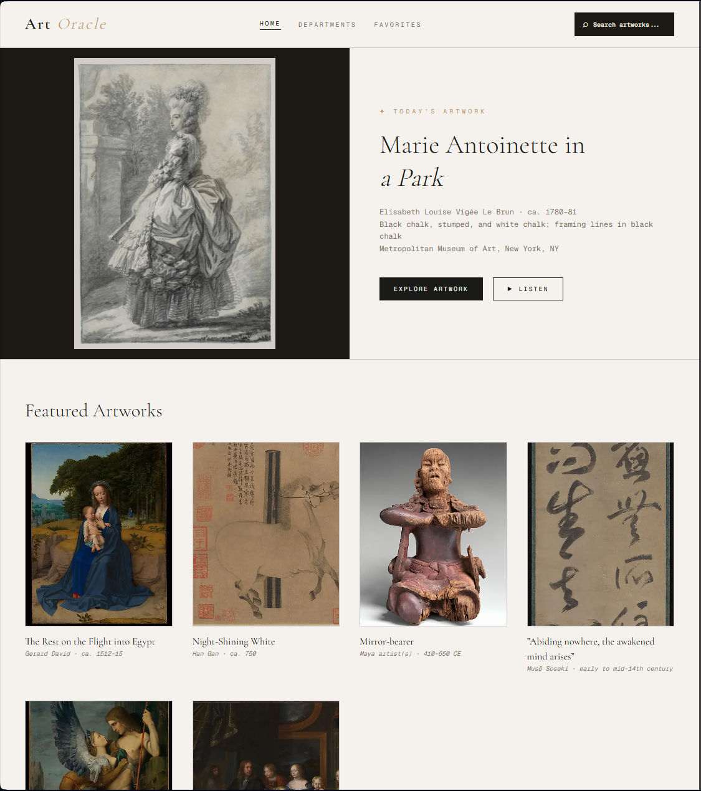
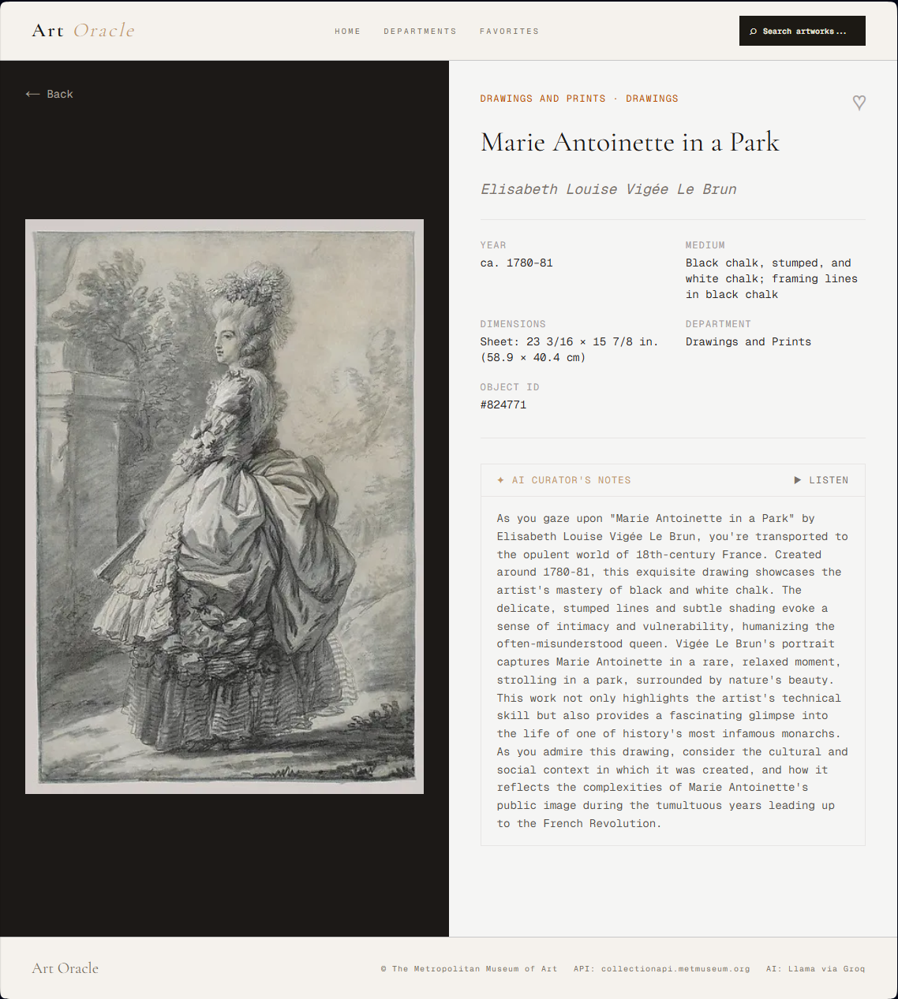
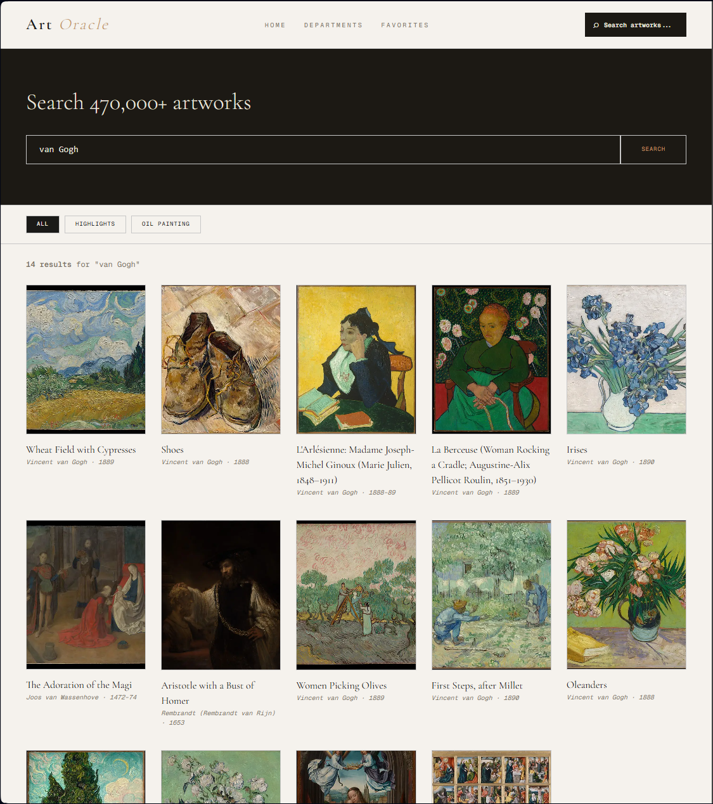
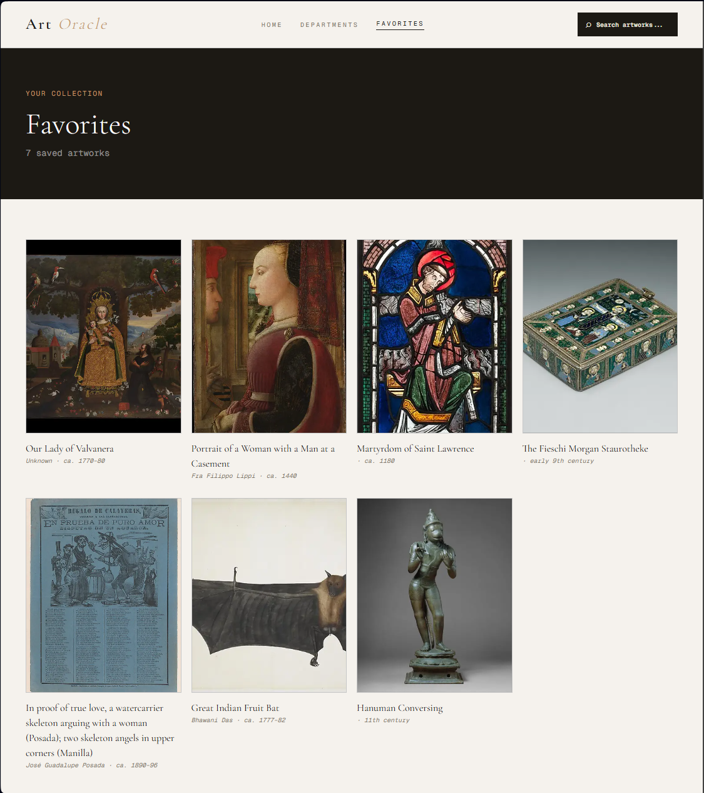
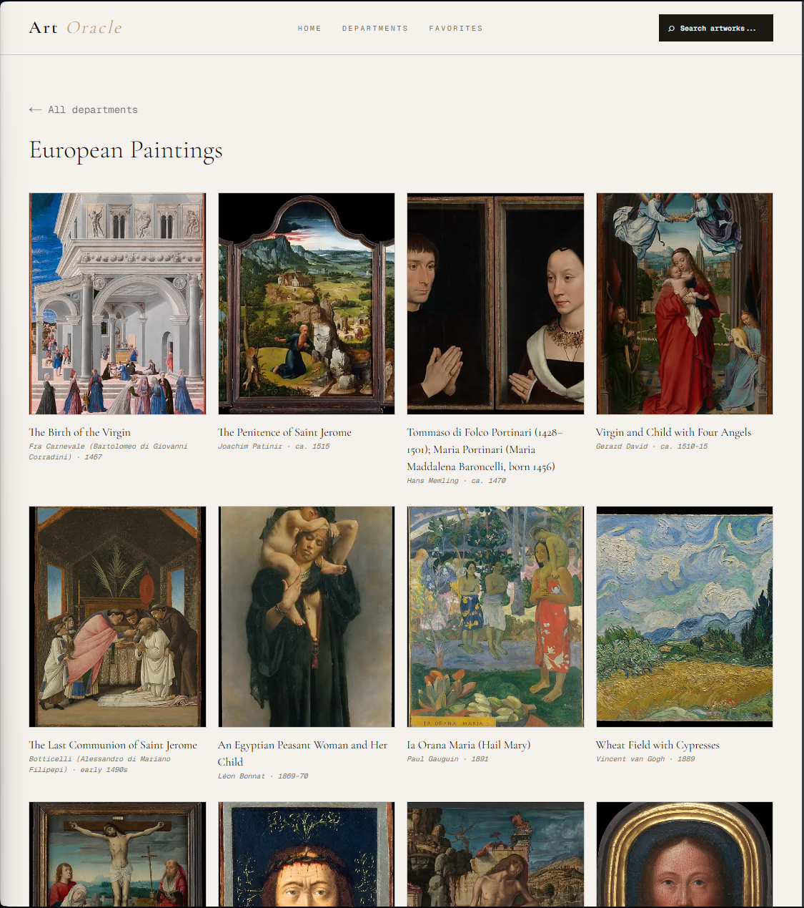

# 🎨 Art Oracle

AI-powered museum explorer built with Next.js, Met Museum API & Groq

🔗 **[Live demo](https://art-oracle.vercel.app)**

Art Oracle lets you explore over 470,000 artworks from the Metropolitan Museum of Art in New York. Pick any artwork and get an AI-generated description read aloud — like having a private museum guide in your pocket.

---

## 📸 Screenshots











---

## ✨ Features

- **Browse artworks** — Explore the Met's 17 departments and 470,000+ works
- **Daily artwork** — A new artwork is highlighted on the homepage every day
- **AI descriptions** — Llama (via Groq) generates a rich, engaging text about each artwork
- **Voice narration** — ElevenLabs reads the description aloud in a deep British voice
- **Search & filter** — Search by artist, title, era or culture
- **Favorites** — Save your favourite artworks locally in the browser

---

## 🛠 Tech Stack

| Tool                    | Purpose                               |
| ----------------------- | ------------------------------------- |
| Next.js 16 (App Router) | Framework, routing, Server Components |
| React 19                | UI components                         |
| TypeScript              | Type safety                           |
| Tailwind CSS v4         | Styling                               |
| Bun                     | Package manager                       |
| Met Museum API          | Artwork data (free, no key required)  |
| Groq API (Llama)        | AI-generated descriptions             |
| ElevenLabs              | Text-to-speech narration              |

---

## 🚀 Getting Started

### Prerequisites

- [Bun](https://bun.sh) installed
- Account at [console.groq.com](https://console.groq.com) for a Groq API key
- Account at [elevenlabs.io](https://elevenlabs.io) for TTS (optional)

### Installation

```bash
git clone https://github.com/ManSaint/art-oracle.git
cd art-oracle
bun install
```

### Environment Variables

Create a `.env.local` file in the project root:

```bash
GROQ_API_KEY=your_groq_key_here
ELEVENLABS_API_KEY=your_elevenlabs_key_here        # Optional
ELEVENLABS_VOICE_ID=JBFqnCBsd6RMkjVDRZzb           # George (default)
```

> **Note:** Never commit `.env.local` to Git. It is already listed in `.gitignore`.

### Run locally

```bash
bun dev
```

Open [http://localhost:3000](http://localhost:3000) in your browser.

---

## 📁 Project Structure

```
art-oracle/
├── app/
│   ├── page.tsx                    # Homepage
│   ├── search/page.tsx             # Search page
│   ├── artwork/[id]/page.tsx       # Artwork detail page
│   ├── departments/[id]/page.tsx   # Department page
│   ├── favorites/page.tsx          # Favorites page
│   └── api/
│       ├── groq/route.ts           # Proxy for Groq/Llama API
│       └── tts/route.ts            # Proxy for ElevenLabs
├── components/                     # Reusable components
├── lib/                            # Utilities, API clients
└── types/                          # TypeScript types
```

---

## 🔑 APIs

**Met Museum API**
Completely free, no API key required.

```
GET https://collectionapi.metmuseum.org/public/collection/v1/search?q=monet
GET https://collectionapi.metmuseum.org/public/collection/v1/objects/[id]
GET https://collectionapi.metmuseum.org/public/collection/v1/departments
```

**Groq API (Llama)**
Called via `/api/groq` to keep the key off the client.

**ElevenLabs TTS**
Called via `/api/tts`. Falls back to the Web Speech API if no key is provided.

---

## 🎨 Design Wireframe

[→ View interactive wireframe](https://mansaint.github.io/art-oracle/wireframe.html)

---

## 📚 Course

Individual project — Lexicon Frontend System Development 2025–2026
